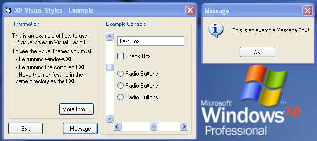



## An example of how to use Windows XP visual themes in VB6

### Description

This code will show you how to write software that uses the new visual style in windows XP!

It is very simple, only 4 line of actual code + XML manifest file
 
### More Info
 

             |
---                |---
**Submitted On**   |2001-10-26 23:54:12
**By**             |[Richard Croxford](https://github.com/Planet-Source-Code/PSCIndex/blob/master/ByAuthor/richard-croxford.md)
**Level**          |Intermediate
**User Rating**    |4.5 (147 globes from 33 users)
**Compatibility**  |VB 6\.0
**Category**       |[Graphics](https://github.com/Planet-Source-Code/PSCIndex/blob/master/ByCategory/graphics__1-46.md)
**World**          |[Visual Basic](https://github.com/Planet-Source-Code/PSCIndex/blob/master/ByWorld/visual-basic.md)
**Archive File**   |[An example3136010262001\.zip](https://github.com/Planet-Source-Code/richard-croxford-an-example-of-how-to-use-windows-xp-visual-themes-in-vb6__1-28444/archive/master.zip)

